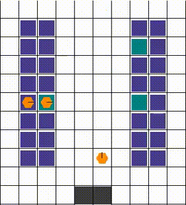
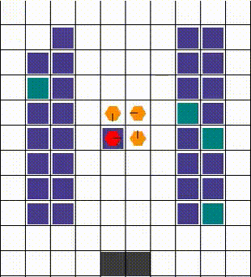
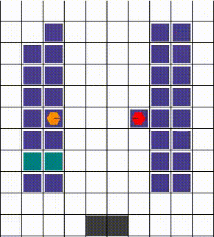
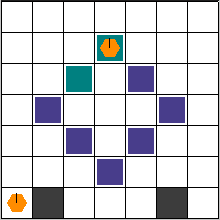

# RDLVY
from RWARE https://github.com/semitable/robotic-warehouse

## Getting started
```shell
cd RDLVY
export PYTHONPATH=$PYTHONPATH:.
python rware/warehouse.py
```

## WorkFlow
Git Workflow: Fork & Pull Request
Formatter: Use black

## Env Description
시작 지점 (물류창고) & package
- 다수의 시작 지점에서 n개의 package가 생성
- 한 개의 시작 지점에 여러개의 package 존재 가능
- 각 pacakge는 모적지가 지정되어 있지 않음

목적지 (배달지)
- n개의 목적지(배달지) 생성
- 목적지에 package를 가진 agent가 도착하면 리워드 생성
  - 해당 목적지는 없어지며 새로운 목적지 생성

Agent
- Agent들이 시작지점에서 package를 load 후 목적지에 배달
- Agent는 여러개의 package를 담을 수 있음

이동 규칙
- 한국의 도로 운행법을 따름
- 직진 및 우회전은 자유롭게 가능
- 유턴 및 좌회전은 교차로(intersection)에서 가능
- 중앙선 침범은 원체 불가능
- 중앙선 방향으로 agent direction 변경 불가

### Package
1. start에서 여러개의 package를 생성
- Package를 담는 request_queue 생성
    - start_candidate 중 하나의 위치에서 생성된 pacakge가 request_queue에 추가됨
    - 같은 위치에 여러개의 package가 생성되어 queue에 추가 가능
    - request_queue는 shelf 사용 시와 달리 start 점에서 package가 agent에 load되면 해당 package가 queue에서 빠짐
    - package가 goal에 도착 시 request_queue에 새로운 package 추가
- starts_with_package_grid 추가
    - 2D girdmap으로 각 cell은 시작 점에 쌓인 package 수를 나타냄
    - obs에 start 점에서 기다리는 pacakge의 위치를 알려주기 위해 생성
2. goal 구현
- goal은 goal_candidates 중에 무작위로 생성
- goal에 agent가 도착하면 package를 가지고 있을 시 자동으로 package 하나를 unload
    - 새로운 goal 생성되고 배달 완료된 goal 없어짐

### HighWay Rules
1. Highways 
- Highway는 agent가 다닐 수 있는 모든 block을 지칭함 (goal 및 start 포함)
    - Highway block은 block마다 해당 도로가 어떤 방향으로 향하는 도로인지인 정보를 가지고 있음(highways_info)
    - Highways info를 따라 agent가 진행할 수 있는 방향이 정해짐
    - 갈 수 있는 진행 방향이 나올 때까지 해당 위치에서 방향 변경(역주행 및 중앙선 침범 금지)

### Layout Rules
Layout의 변경을 원하는 경우 아래의 규칙을 따라 작성해야만 도로 주행 로직이 정상적으로 작동함
1. Layout의 모든 point는 'r', 'l', 'u', 'd', '.', 'x', 's', 'g' 중 하나여야 함
2. 'x'의 경우 highway가 아닌 장애물을 나타냄
3. 'r', 'l', 'u', 'd'의 경우, intersection을 제외한 highway를 구성하고 해당 point에서 highway info를 결정함
- 사거리 및 삼거리
    - 사거리 및 삼거리의 경우 intersection layout('.')을 !!사용하지 않고!! 구성해야 함.

          4 way highway example
          ...
          x x x x d u x x x x
          x x x x d u x x x x
          x x x x d u x x x x
          l l l l d l l l l l
          r r r r r u r r r r
          x x x x d u x x x x
          x x x x d u x x x x
          ...


          3 way highway example
          ...
          x x x x d u x x x x
          x x x x d u x x x x
          x x x x d u x x x x
          x x x x d u x x x x
          l l l l d l l l l l
          r r r r r r r r r r
          x x x x x x x x x x


4. '.'는 intersection을 나타내는 layout으로, 단방향 코너 (!!사거리, 삼거리 미포함!!) 및 layout의 가장자리까지 도로가 연결되는 경우에서만 사용해야 함
- Intersection 
    - Intersection point에서 highway info는 ALL
    - Intersection에는 두 가지 type이 있음
        - Intersection 1

          the () point: inner corner point of corner street.
          Intersection 1에서는 1방향으로만 진행 가능

              x x x x d u x x x x
              l l l l(.)u x x x x
              r r r r r . x x x x
              x x x x x x x x x x
    
        - Intersection 3

          the () point: outer corner point of corner street.
          Intersection 3에서는 3방향 탐색 및 전진 가능

              x x x x d u x x x x
              l l l l . u x x x x
              r r r r r(.)x x x x
              x x x x x x x x x x

    - Layout 가장자리에서 사용하는 경우, Uturn을 위한 포인트로, 가장자리에 진입하는 point에만 사용해야 함

          Edge point example
          x x x x d(.)x x x x
          x x x x d u x x x x
          x x x x d u x x x x
          ...

5. 's'는 start point를 나타냄.
- start point는 물건을 싣는 곳으로, rendering 상에서는 빨간색으로 표시되고, starting point에 적재된 package가 없을 경우 옅은 분홍색

6. 'g'는 goal point candidate를 나타냄.
- Layout에서 g로 표시된 곳 중 파라미터의 goal포인트 수 만큼 goal을 랜덤하게 선택하여 초기화. Goal point로 선정된 곳에 패키지가 배달되면 해당 포인트는 goal point에서 제거되며 새로운 goal point가 goal point candiate 중에 랜덤하게 선택되어 생성됨.
- Layout에서 'g'는 상당히 많아도 됨. 길을 따라 모든 곳에 생성 가능.


## Observation우
TODO서


<p align="center">
 
 <p align="center">A multi-agent reinforcement learning environment</p>
</p>

[](https://GitHub.com/Naereen/StrapDown.js/graphs/commit-activity)
[](https://github.com/Naereen/StrapDown.js/blob/master/LICENSE)

<h1>Table of Contents</h1>

- [Environment Description](#environment-description)
  - [What does it look like?](#what-does-it-look-like)
  - [Action Space](#action-space)
  - [Observation Space](#observation-space)
  - [Dynamics: Collisions](#dynamics-collisions)
  - [Rewards](#rewards)
- [Environment Parameters](#environment-parameters)
  - [Naming Scheme](#naming-scheme)
  - [Custom layout](#custom-layout)
- [Installation](#installation)
- [Getting Started](#getting-started)
- [Please Cite](#please-cite)


# Environment Description

The multi-robot warehouse (RWARE) environment simulates a warehouse with robots moving and delivering requested goods. The simulator is inspired by real-world applications, in which robots pick-up shelves and deliver them to a workstation. Humans access the content of a shelf, and then robots can return them to empty shelf locations.

The environment is configurable: it allows for different sizes (difficulty), number of agents, communication capabilities, and reward settings (cooperative/individual). Of course, the parameters used in each experiment must be clearly reported to allow for fair comparisons between algorithms.

## What does it look like?

Below is an illustration of a small (10x20) warehouse with four trained agents. Agents have been trained with the SEAC algorithm [[2](#please-cite)]. This visualisation can be achieved using the `env.render()` function as described later.

<p align="center">
 
</p>


## Action Space
In this simulation, robots have the following discrete action space:

A={ Turn Left, Turn Right, Forward, Load/Unload Shelf }

The first three actions allow each robot only to rotate and move forward. Loading/Unloading only works when an agent is beneath a shelf on one of the predesignated locations.

## Observation Space
The observation of an agent is partially observable and consists of a 3x3 (configurable) square centred on the agent. Inside this limited grid, all entities are observable:
- The location, the rotation and whether the agent is carrying a shelf.
- The location and rotation of other robots.
- Shelves and whether they are currently in the request queue.

## Dynamics: Collisions
The dynamics of the environment are also of particular interest. Like a real, 3-dimensional warehouse, the robots can move beneath the shelves. Of course, when the robots are loaded, they must use the corridors, avoiding any standing shelves.

Any collisions are resolved in a way that allows for maximum mobility. When two or more agents attempt to move to the same location, we prioritise the one that also blocks others. Otherwise, the selection is done arbitrarily. The visuals below demonstrate the resolution of various collisions.

 Example 1                 |   Example 2               | Example 3
:-------------------------:|:-------------------------:|:-------------------------:
  |    |  

## Rewards
At each time a set number of shelves R is requested. When a requested shelf is brought to a goal location, another shelf is uniformly sampled and added to the current requests. Agents are rewarded for successfully delivering a requested shelf to a goal location, with a reward of 1. A significant challenge in these environments is for agents to deliver requested shelves but also finding an empty location to return the previously delivered shelf. Having multiple steps between deliveries leads a very sparse reward signal.

# Environment Parameters

The multi-robot warehouse task is parameterised by:

- The size of the warehouse which is preset to either tiny (10x11), small (10x20), medium (16x20), or large (16x29).
- The number of agents N.
- The number of requested shelves R. By default R=N, but easy and hard variations of the environment use R = 2N and R = N/2, respectively.

Note that R directly affects the difficulty of the environment. A small R, especially on a larger grid, dramatically affects the sparsity of the reward and thus exploration: randomly bringing the correct shelf becomes increasingly improbable.

## Naming Scheme

While RWARE allows fine tuning of multiple parameters when using the Warehouse class, it also registers multiple default environments with Gym for simplicity.

The registered names look like `rware-tiny-2ag-v1` and might cryptic in the beginning, but it is not actually complicated. Every name always starts with rware. Next, the map size is appended as -tiny, -small, -medium, or -large. The number of robots in the map is selected as Xag with X being a number larger than one (e.g. -4ag for 4 agents). A difficulty modifier is optionally appended in the form of -easy or -hard, making requested shelves twice or half the number of agents (see section Rewards). Finally -v1 is the version as required by OpenAI Gym. In the time of writing all environments are v1, but we will increase it during changes or bugfixes.

A few examples:
```python
env = gym.make("rware-tiny-2ag-v1")
env = gym.make("rware-small-4ag-v1")
env = gym.make("rware-medium-6ag-hard-v1")
```


Of course, more settings are available, but have to be changed during environment creation. For example:
```python
env = gym.make("rware-tiny-2ag-v1", sensor_range=3, request_queue_size=6)
```

## Custom layout
You can design a custom warehouse layout with the following:
```python
layout = """
.......
...x...
..x.x..
.x...x.
..x.x..
...x...
.g...g.
"""
gym = env.make("rware:rware-tiny-2ag-v1", layout=layout)
```
This will transform "X"s to shelves and "G"s to goal locations with a result like the one below:
<p align="center">
 
</p>


A detailed explanation of all parameters can be found [here](https://github.com/semitable/robotic-warehouse/blob/4307b1fe3afa26de4ca4003fd04ab1319879832a/robotic_warehouse/warehouse.py#L132)

# Installation

Assuming you have Python3 (preferably on a virtual environment: venv or Anaconda) installed, you can use PyPI:
```sh
pip install rware
```

If you prefer to have the code available and be able to edit it, you can use Git to download and install it:
```sh
git clone git@github.com:uoe-agents/robotic-warehouse.git
cd robotic-warehouse
pip install -e .
```

# Getting Started

RWARE was designed to be compatible with Open AI's Gym framework.

Creating the environment is done exactly as one would create a Gym environment:

```python
import gym
import rware
env = gym.make("rware-tiny-2ag-v1")
```

You can even bypass the `import` statement with Gym, and directly use:
```python
import gym
env = gym.make("rware:rware-tiny-2ag-v1")
```
The `rware:` in the beginning of the environment name tells Gym to import the respective package.

The number of agents, the observation space, and the action space are accessed using:
```python
env.n_agents  # 2
env.action_space  # Tuple(Discrete(5), Discrete(5))
env.observation_space  # Tuple(Box(XX,), Box(XX,))
```

The returned spaces are from the Gym library (`gym.spaces`) Each element of the tuple corresponds to an agent, meaning that `len(env.action_space) == env.n_agents` and `len(env.observation_space) == env.n_agents` are always true.

The reset and step functions again are identical to Gym:

```python
obs = env.reset()  # a tuple of observations

actions = env.action_space.sample()  # the action space can be sampled
print(actions)  # (1, 0)
n_obs, reward, done, info = env.step(actions)

print(done)    # [False, False]
print(reward)  # [0.0, 0.0]
```
which leaves as to the only difference with Gym: the rewards and the done flag are lists, and each element corresponds to the respective agent.

Finally, the environment can be rendered for debugging purposes:
```python
env.render()
```
and should be closed before terminating:
```python
env.close()
```


# Please Cite
If you use this environment, consider citing
1. A comperative evaluation of MARL algorithms that includes this environment
```
@inproceedings{papoudakis2021benchmarking,
   title={Benchmarking Multi-Agent Deep Reinforcement Learning Algorithms in Cooperative Tasks},
   author={Georgios Papoudakis and Filippos Christianos and Lukas Schäfer and Stefano V. Albrecht},
   booktitle = {Proceedings of the Neural Information Processing Systems Track on Datasets and Benchmarks (NeurIPS)},
   year={2021},
   url = {http://arxiv.org/abs/2006.07869},
   openreview = {https://openreview.net/forum?id=cIrPX-Sn5n},
   code = {https://github.com/uoe-agents/epymarl},
}
```
2. A method that achieves state-of-the-art performance in the robotic warehouse task
```
@inproceedings{christianos2020shared,
 author = {Christianos, Filippos and Sch\"{a}fer, Lukas and Albrecht, Stefano},
 booktitle = {Advances in Neural Information Processing Systems},
 editor = {H. Larochelle and M. Ranzato and R. Hadsell and M. F. Balcan and H. Lin},
 pages = {10707--10717},
 publisher = {Curran Associates, Inc.},
 title = {Shared Experience Actor-Critic for Multi-Agent Reinforcement Learning},
 url = {https://proceedings.neurips.cc/paper/2020/file/7967cc8e3ab559e68cc944c44b1cf3e8-Paper.pdf},
 volume = {33},
 year = {2020}
}

```

