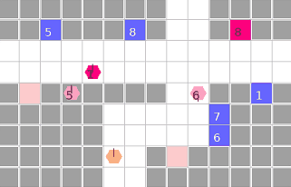

# RDLVY
[](https://github.com/Naereen/StrapDown.js/blob/master/LICENSE)

***NOTE: This environment is not under maintenance for now, as we are currently developing a new graph-based multi-robot delivery environment!***

We modified the robotic-warehouse environment [RWARE](https://github.com/semitable/robotic-warehouse)[1] to create a gird-based robotic-delivery environment.

Below is a rendering of 4 agents with random policy in small (9x14) RDLVY envrionment.

<p align="center">
 
</p>

Our research will be done on a map modeled after Sangam-dong, Seoul, Repulic of Korea.

<p align="center">
 
</p>


<h1>Table of Contents</h1>

- [RDLVY](#rdlvy)
  - [Getting started](#getting-started)
  - [Environment Description](#environment-description)
    - [Warehouses (Start)](#warehouses-start)
    - [Destination (Goal)](#destination-goal)
    - [Agent](#agent)
    - [Package](#package)
    - [Highway Rules](#highway-rules)
    - [Layout Rules](#layout-rules)
  - [Observations](#observations)
    - [Image observations description](#image-observations-description)
    - [\[WIP\] Dictionary observations description](#wip-dictionary-observations-description)
  - [Reward](#reward)
  - [Authors](#authors)
  - [Reference](#reference)


## Getting started
```shell
cd RDLVY
export PYTHONPATH=$PYTHONPATH:.
python rdlvy/robot_delivery.py
```

## Environment Description

### Warehouses (Start)
- N (equal to `request_queue_size`) number of packages are generated across multiple warehouses.
- Multiple packages can be stored in each warehouse.

### Destination (Goal)
- N number of destinations are generated.
- When an agent with a package arrives at a destination, the package is automatically unloaded and rewards are given.
    - That destination is then removed and a new destination is created from among the potential goal candidates.

### Agent
- Agents load packages from the warehouse (start) to deliver them to the destination (goal).
- Agents can carry multiple packages at a time.

### Package
- Packages do not have designated destinations.
- `request_queue`
    - Packages are generated at one of the `start_candidates` (warehouse) and added to the `request_queue`.
    - Packages are removed from the `request_queue` once they are picked up by an agent.
    - When a package is delivered, a new package is generated and added to the `request_queue`.
- `starts_with_package_grid`
    - A 2D grid map which represents the number of packages residing in a warehouse.

### Highway Rules
- The highway represents cells that agents can travel on, including goal and start cells.
    - A highway cell contains information about the directions an agent can travel to (`highways_info`).
    - If an agent chooses an action that is illegal, no action is taken.
- Agents can go straight or turn right on any highway cell.
- Agents can turn left or make a U-turn only at intersections.


### Layout Rules
Please refer to the following rules to modify the layout of the map.
1. Element in the layout should be  represented using one of the following characters:  'r', 'l', 'u', 'd', '.', 'x', 's' or 'g'.
2. 'x' represents obstacles.
3. 'r', 'l', 'u', 'd' represent highways.
- Four-way and three-way junctions
    - Constructed them **without** intersection layout denoted by '.'.

          4-way junction example
          ...
          x x x x d u x x x x
          x x x x d u x x x x
          x x x x d u x x x x
          l l l l d l l l l l
          r r r r r u r r r r
          x x x x d u x x x x
          x x x x d u x x x x
          ...

          3-way junction example
          ...
          x x x x d u x x x x
          x x x x d u x x x x
          x x x x d u x x x x
          x x x x d u x x x x
          l l l l d l l l l l
          r r r r r r r r r r
          x x x x x x x x x x
4. The '.'character should only be used at the corners and edges of the map.
    - '.' represents intersectin cell in following usage.
        - Intersection 1

          the () point: inner corner point of a corner street.
          Agents can move in only one direction.

              x x x x d u x x x x
              l l l l(.)u x x x x
              r r r r r . x x x x
              x x x x x x x x x x
    
        - Intersection 3
  
          the () point: outer corner point of corner street.
          Agents can move in three direction.

              x x x x d u x x x x
              l l l l . u x x x x
              r r r r r(.)x x x x
              x x x x x x x x x x

    - '.' represents u-turn cell in following usage.
          
          Edge point example
          x x x x d(.)x x x x
          x x x x d u x x x x
          x x x x d u x x x x
          ...

5. 's' represents warehouse (start) candidates.
6. 'g' represents destination (goal) candidates.
   

## Observations
### Image observations description
- SEHLVES: Represents obstacles.
- REQUESTS: Represents requested 'packages'.
- AGENTS
- AGENT_DIRECTION
- AGENT_LOAD: Displays whether agents are carrying packages (1) or not (0).
- GOALS: Represents the requested goals
- ACCESSIBLE: 0 if cell is occupied by other agent
- Entire observation can be accessed by setting observation_type=ObsevationType.IMAGE and use_full_obs=True option when initializing the environment.
- image_observation_layers=[

    ImageLayer.SHELVES,

    ImageLayer.REQUESTS,

    ImageLayer.AGENTS,

    ImageLayer.AGENT_DIRECTION,

    ImageLayer.AGENT_LOAD,

    ImageLayer.GOALS,

    ImageLayer.ACCESSIBLE

  ]


### [WIP] Dictionary observations description
obs["self"]
- location
- carrying_shelf -> represents number of carrying 'package'
- direction
- on_highway

obs["sensors"][i]
- has_agents
- direction
- local_message
- has_shelf -> represents shelf(=obstacle)
- shelf_requested -> represents if there is 'package' requested
- goal_requested -> represents if there is 'goal' requested


## Reward
- RewardType.GLOBAL: Every agents get +1 reward when the package is delivered.
- RewardType.INDIVIDUAL: Agent is awarded +1 reward when it delivery the packages.
- RewardType.TWO_STAGE: Agent is awarded +0.5 reward when it loads the packages and +0.5 when it deliver the package to the destination.

## Authors
[Jaewon Lee](https://github.com/e-j-one) and [Junseok Kim](https://github.com/1kjs) from [Robot Learning Laboratory](https://rllab.snu.ac.kr/)

## Reference
[1] https://github.com/semitable/robotic-warehouse

[2] Filippos, C., Schäfer, L., & Albrecht, S. (2020). Shared Experience Actor-Critic for Multi-Agent Reinforcement Learning [Conference paper]. 33, 10707–10717. https://arxiv.org/abs/2006.07169
